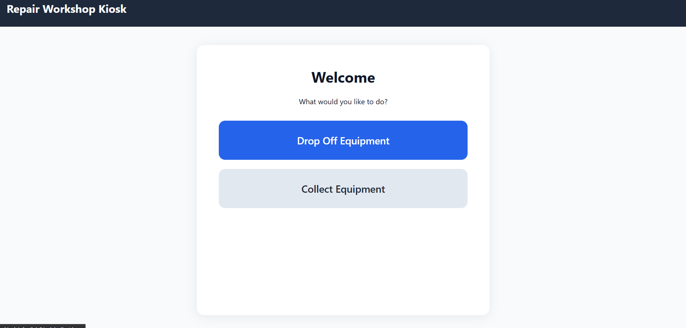

# Repair Workshop Self-Service Kiosk

A self-service drop-off and collection terminal for an equipment repair workshop. Borrowers scan a barcode to drop off broken equipment, get a QR-coded tracking slip, and collect their item later by scanning the same code at the kiosk. Staff manage the repair lifecycle through a separate panel.

Built with plain PHP (no framework), MySQL, and vanilla JS — designed to run on shared hosting with no Composer dependency required.

## 🔗 Live Demo

| | |
|---|---|
| **Kiosk (public terminal)** | [https://bes-kiosk.infy.click/kiosk](https://bes-kiosk.infy.click/kiosk) |
| **Staff panel login** | [https://bes-kiosk.infy.click/staff/login](https://bes-kiosk.infy.click/staff/login) |
| **Test credentials** | `admin` / `Admin@123` |

> ⚠️ These are demo/testing credentials on a live but non-production deployment. Please don't rely on this instance for real workshop use, and expect data to be reset periodically during development.

Try the full loop: drop off a test item at the kiosk (any asset tag, e.g. `AST-000001`), note the QR code on the confirmation screen, then log into the staff panel to move it through the repair stages, and scan the QR again once it's marked ready for collection.

## Screenshots

**Kiosk home screen**



## Features

- **Kiosk drop-off wizard** — scan asset tag → identify borrower → describe fault → confirm → printable QR slip
- **Kiosk collection wizard** — scan QR or asset tag → verify → confirm collection
- **Public tracking page** — borrowers check repair status anytime via the QR code, no login required
- **Staff panel** — login, dashboard, job list, and status management
- **Enforced state machine** — job status transitions are validated server-side (`app/Services/JobService.php`), not just hidden in the UI — an illegal or out-of-order status change is rejected even if someone tampers with the request
- **IDOR-safe public tracking** — tracking links use random 32-character tokens rather than sequential job IDs, so one QR code can't be used to guess or browse other people's repair jobs

## Tech Stack

- PHP 8.1+ (no framework — custom router/MVC core in `app/Core/`)
- MySQL / MariaDB
- Vanilla HTML/CSS/JS
- QR codes generated client-side via [api.qrserver.com](https://goqr.me/api/) — no server-side image library needed

## Local Setup (WAMP / XAMPP)

1. Clone this repo into your web server's document root.
2. Import the schema:
   ```
   mysql -u root -p < database/schema.sql
   ```
3. Copy `.env.example` to `.env` and fill in your local database credentials.
4. Point your virtual host's document root at the `public/` folder.
5. Visit `/kiosk` to test the drop-off/collection flow, `/staff/login` for the staff panel.

## Deployment Notes

This project has been deployed and tested on [InfinityFree](https://infinityfree.com) free hosting, which has a couple of quirks worth knowing if you deploy there too:

- **PHP is sandboxed to the `htdocs` folder** — it cannot read files placed outside the web root, even though FTP/File Manager can see them. This means `app/`, `database/`, `storage/`, and `.env` all have to live *inside* `htdocs`, with an `.htaccess` rule blocking direct HTTP access to them instead of relying on filesystem separation.
- **`CREATE VIEW` is not permitted** on free-tier MySQL accounts. Any query that would normally hit a database view needs to be written as a plain `SELECT ... JOIN` instead.

## Project Structure

```
app/
├── Config/        # app settings, DB connection, routes, status state machine
├── Core/          # router, request/response, session, auth, DB wrapper
├── Controllers/   # Kiosk/, Staff/, Api/, and the public tracking controller
├── Models/        # Equipment, Borrower, RepairJob, User, etc.
├── Services/      # JobService (state machine), TokenService, QrService
└── Views/         # kiosk, staff, public, and print-slip templates
database/
└── schema.sql     # full DDL + seed data
public/
└── index.php      # front controller
```

## Known Limitations (v1)

- No equipment/borrower/staff-user admin CRUD screens yet — manage these directly via phpMyAdmin for now
- No photo upload on drop-off, no signature capture on collection
- No reports/CSV export
- Single role check (logged in vs. not) — no granular admin-vs-technician restrictions yet

## License

MIT (or update to whatever you prefer)
